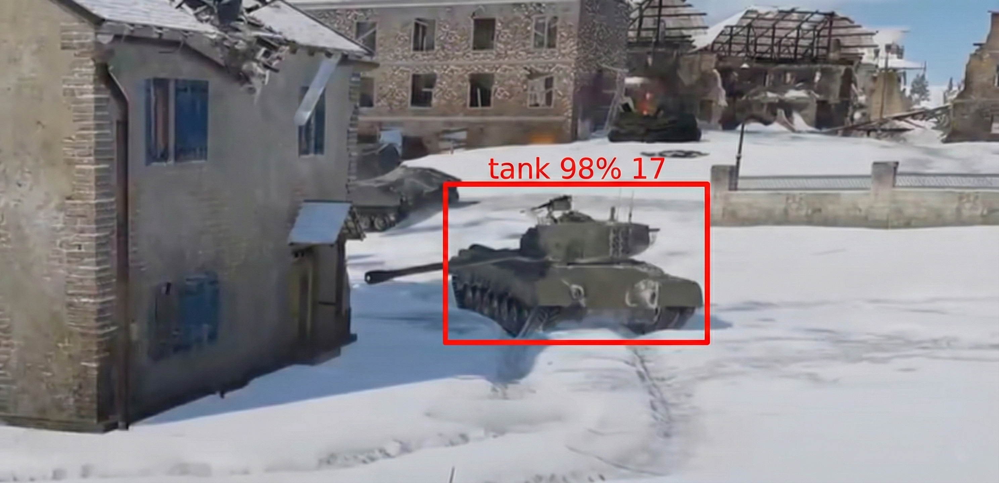
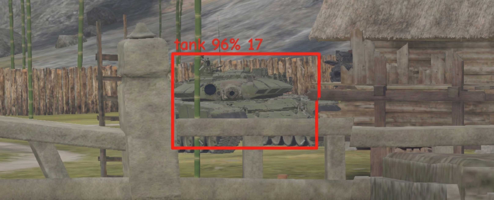
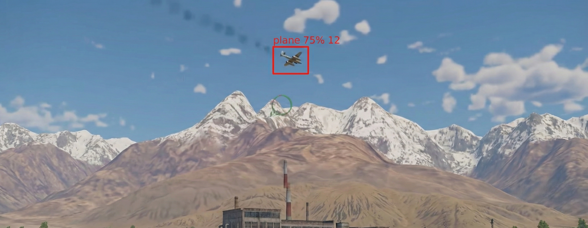
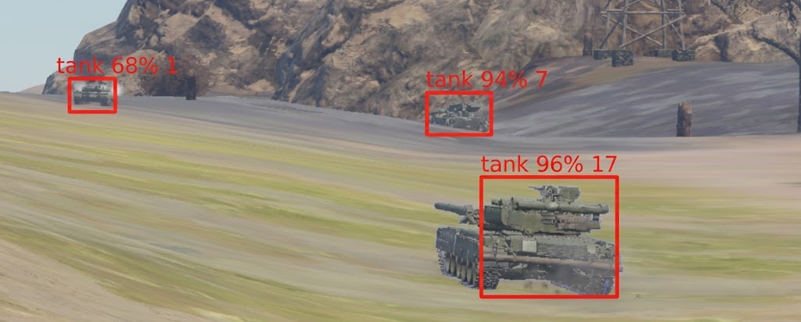

Real-Time Object Detection Pipeline in High-Fidelity Synthetic Environments

Project Overview

This repository contains a high-performance computer vision system designed for real-time detection and tracking of complex mechanical structures. By utilizing a high-fidelity simulation environment (War Thunder) as a proxy for real-world scenarios, the project explores the limits of object detection in "noisy" environments—characterized by dynamic weather, varied topography, and sophisticated camouflage.

The system is optimized for NVIDIA CUDA and achieves an inference throughput of ~142 FPS, demonstrating significant efficiency in high-speed data processing and decision-making.

Visual Performance Gallery

<table style="width:100%; border-collapse: collapse;"> <tr> <td style="width:50%; padding:10px; vertical-align: top;">  
<b>Fig 1: System-wide Detection Overview</b>

 Demonstration of the unified detection pipeline identifying multiple target classes simultaneously. The system maintains high confidence intervals across the entire viewport, showcasing the model's ability to handle high-density visual data without performance degradation.
 </td> <td style="width:50%; padding:10px; vertical-align: top;">  
<b>Fig 2: Detection of Partially Occluded Armor</b>

 A critical test of the ensemble model's precision. Here, the system successfully identifies a target despite significant environmental "noise" and sophisticated camouflage patterns, proving the robustness of the custom-labeled 4,000-image dataset in edge-case scenarios.
 </td> </tr> <tr> <td style="width:50%; padding:10px; vertical-align: top;">  
<b>Fig 3: Aerial Target Acquisition (High Velocity)</b>

 Tracking of high-velocity aerial assets. This figure highlights the low-latency interop between the Windows Graphics Capture API and the CUDA-accelerated inference engine, allowing for precise coordinate prediction even with rapid pixel-space translation.
 </td> <td style="width:50%; padding:10px; vertical-align: top;">  
<b>Fig 4: Real-time Multi-Target Coordinate Mapping</b>

 Visualization of the coordinate extraction process. The system doesn't just "detect" but maps targets into a spatial grid, calculating distances and relative vectors. This serves as a foundation for autonomous decision-making and trajectory analysis.
 </td> </tr> </table>

Technical Architecture

1. High-Speed Inference Engine

The core of the project is written in C++ to minimize overhead, utilizing Windows.Graphics.Capture for low-latency frame acquisition without memory leaks. The pipeline integrates:

OpenCV 4.10.0 (Built with CUDA 12.5 & cuDNN 9.2.0 support).

Darknet/YOLO for neural network inference.

Custom Memory Management: Ensuring stable performance during long-duration execution.

2. Model Evolution & Ensemble Approach

To achieve a balance between spatial precision and temporal speed, I experimented with multiple architectures:

YOLO-Mini/Tiny: Tested for ultra-low latency applications.

High-Parameter YOLO: Evaluated for high-confidence identification at extreme ranges.

Ensemble Methodology: The current production model is a hybrid result that combines features from two distinct architectures. This approach allows the system to maintain high confidence scores (90%+) while keeping the processing time per frame under 7ms.

3. Data Engineering (Dataset Selection)

A primary focus was the creation of a high-quality, manually labeled dataset derived from high-fidelity simulation feeds. This dataset was specifically curated to handle edge cases like atmospheric haze, motion blur, and terrain interference.

Ground Targets (Tanks): 4,000+ images, meticulously labeled to include varied angles and lighting.

Aerial Targets (Planes/Helicopters): 230+ specialized images for high-speed tracking.

Source: All frames were extracted from custom-made recordings to ensure high-variance data (desert, forest, urban, and arctic environments).

Research Significance

This project serves as a demonstration of Heterogeneous Computing (CPU/GPU load balancing). While the simulation provides the visual data, the architectural challenges—synchronizing data between VRAM and system memory, optimizing tensor operations, and handling massive data throughput—are directly applicable to real-time analysis systems used in high-energy physics and autonomous research.

Building and Installation

Environment: VS2022, CUDA 12.5, cuDNN 9.2.0.

Dependencies: Build OpenCV from source with CUDA support.

Project: Load WT.sln.

Inference: Deploy the provided .weights and .cfg files to the root directory.